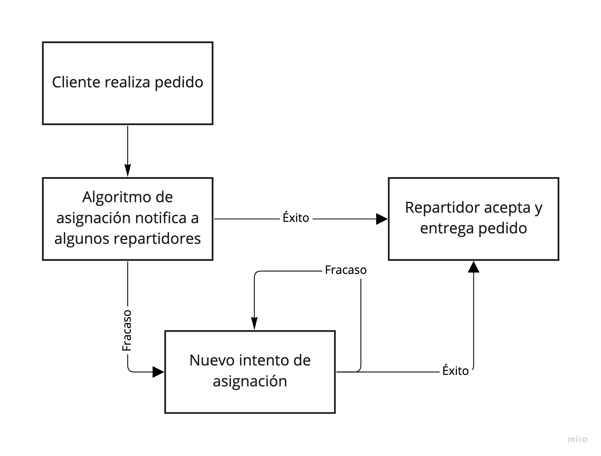

# Preguntas del desafío
> Por Katherine Páez Ramos

## Pregunta 1 
Cuéntanos qué piezas de software crees que sea necesario desarrollar para el prototipo funcional y cómo se relacionan estas. Llamamos pieza de software a cada aplicación (web, móvil o de escritorio), cada API, cada proceso batch que se puede desplegar de forma independiente. 

 **Respuesta 1**

El prototipo debe cubrir el caso del cliente que realiza un pedido y encargarse de realizar los procesos para permitir que sus productos lleguen a través del repartidor, como muestra el siguiente diagrama:

Del primer acercamiento obtenemos lo siguiente:

En front, App cliente y repartidor para cada uno de esas entidades involucradas. Sus objetivos y usos son distintos, por lo que deben separarse. Para el prototipo solo consideraremos que tendrán que ser mobile para comodidad, pero eventualmente se puede expandir a una opción web. También, un panel para visualizar los pedidos e incluso precios por parte de quienes venden los productos.

Para el backend que se encargará de la gestión de operación (registro de usuarios, pedidos, etc) micro servicios. En este caso, los procesos del negocio estamos suponiendo que son simples. Lo que sí podemos construir aparte y quizás como monolito es la solución para la asignación de los pedidos.

## Pregunta 2
Cuéntanos sobre el tipo de arquitectura que elegiste para la pregunta (1). ¿Monolítica? ¿Micro-servicios? ¿Algún intermedio? ¿Otra? Comenta en qué te basaste para tomar esta decisión

**Respuesta 2**

Si bien para prototipado un monolito es la opción por ser rápido y simple de desplegar, el tipo de problema logístico de una app de repartidor tiene particularidades de escalamiento temporal y una posibilidad alta de acoplamiento excesivo a medida que crece el negocio que no se pueden ignorar. Por lo mismo podría ser más útil partir montando una arquitectura de micro-servicios desde el comienzo o al menos un intermedio que apunte a permitir que lo vital pueda tener los beneficios de MS. Es más costoso ponerlo en funcionamiento, pero lo podríamos compensar al utilizar a los dos miembros temporales del equipo (Data scientist e ingeniero ML) en el trabajo paralelo de generar el módulo vital del negocio que es el algoritmo de asignación del pedido, mientras el resto trabaja en apps y la gestión de operación; y quizás, un monolito para manejar precios y productos.

## Pregunta 3
Describe la metodología de trabajo que usarías para el desarrollo. Puede ser alguna metodología conocida (Scrum, XP, RUP), una adaptación, o una mezcla entre varias metodologías. Lo que sea que tu experiencia te haya mostrado que funciona. Cuéntanos por qué crees que esta forma es adecuada para nuestro problema.

**Respuesta 3**

Las metodologías mencionadas tienen prácticas Lean que son clave para el tipo de proyecto, pero al ser un equipo pequeño cosas como XP o RUP supondría incorporar obstáculos extra si seguimos al pie de la letra sus elementos. Probablemente habría que hacer una mezcla, tomar por ejemplo ciertas ideas de documentación junto a scrum y el clásico kanban. El equipo actual permite tener reuniones constantes, pero fluidas y responder rápido ante decisiones de cambio que es posible que se den a partir del segundo o tercer sprint de trabajo. Además, la característica de equipo diverso, permite distribuir trabajos, pero requiere una comunicación sólida para avanzar en sinergia, así que tener un backlog priorizado, construir sprints, asignar tareas y realizar reuniones diarias junto a reuniones de review sería la metodología que usaría.

## Pregunta 4
Describe el workflow que usarías para colaborar usando Git. Al igual que con (3), puedes usar algo conocido o una adaptación.

**Respuesta 4**

Probalemente una versión Git Flow relajada. Tener una rama principal para producción y una rama de desarrollo para ambiente de prueba y que siempre está más adelante que producción. Aparte respetar la generación de ramas de dos categorías que debemos tener con sus respectivos prefijos: primero para cualquier ajuste a código que ya está en producción (o listo para desplegarse en la rama principal), crear una rama fix que nace de la rama principal y luego será devuelta a esa misma rama y también agregada a la de desarrollo. Y por otro lado las ramas release que nacen de las de desarrollo, contienen las nuevas funcionalidades ya listas para ser agregadas a la rama principal. Podemos tener en una carpeta aparte las ramas usualmente locales que tienen solo las nuevas funcionalidades, las que son previas a las ramas release, solo para llevar un registro.

## Pregunta 5 
¿Crees que sea necesario agregar algún integrante extra al equipo durante el desarrollo del prototipo? ¿Cuál sería su rol? ¿Crees que sería necesario agregar nuevos integrantes después de la fase de prototipo? ¿Cuándo y por qué?

**Respuesta 5**

Por cómo estamos resolviendo el problema, en la etapa de prototipado probablemente tener disponible a un especialista en devOps o cloud, en la misma calidad que el MLE y el data scientist, para facilitar el uso de la arquitectura y orientar los procesos adecuados. Cuando se inicie una fase posterior al prototipo, dependiendo del objetivo y la priorización de tareas de mejora para alcanzar un producto robusto, podemos pensar en sumar, de forma temporal al menos, un encargado de testing junto a un especialista en ux para ser capaces de ir refinando el producto sprint a sprint. Si se agrega o no más desarrolladores dependerá de los plazos que se estimen para el proyecto y si es necesario mejorar la velocidad de implementación.

## Pregunta 6
¿Qué otras consideraciones tendrías para hacer el proceso de desarrollo robusto y eficiente?

**Respuesta 6**

Hay una gran variedad de productos que hacen lo mismo, por lo que tener claro cuál sería la propuesta de valor en la construcción del prototipo sirve para orientar esfuerzos hacia puntos que más sirven. Dolores importantes del negocio serían entregados por impact Lead, probablemente entre ellos la geolocalización (eg. hay lugares en Chile bien complejos de localizar), la interacción y procesos general de pedido y la experiencia de espera junto a la comunicación con los repartidores puede ser otra variable. Tener un roadmap claro también será importante para entender cómo delimitar el proyecto y priorizar según fases de forma correcta, así ante cambios se reconoce rápido lo que se aplica y lo que pertenece a otra etapa. Por otro lado, algo que no habíamos mencionado, en algún punto también hay que involucrar pruebas de performance, al menos de estrés, para saber que lo se construye es una base sólida.
